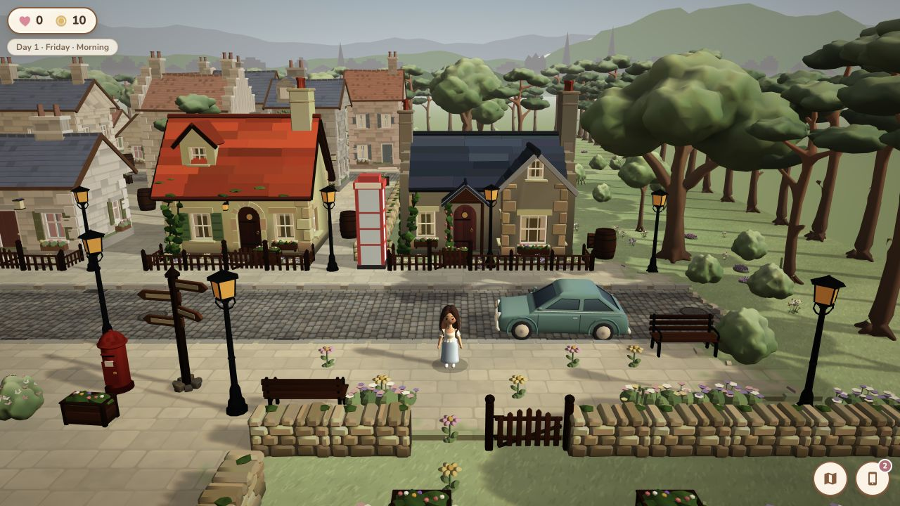

# Babylon 3D performance baseline

Captured before the optimization changes on `codex/3d-performance-pass`. This is a diagnostic baseline, not a physical-device certification.

## Test environment and method

- macOS host, Codex in-app Chromium, WebGL 2.
- 1280 × 720 CSS viewport, device pixel ratio 2.
- Fixed benchmark state: Edinburgh Old Town spawn, no movement, fixed time of day.
- Five rendered frames were allowed to settle before deterministic scene counts were recorded.
- GPU timer queries were unavailable, so GPU time is reported as `n/a`.
- Browser automation and software timing disturbed frame scheduling. FPS/frame-time values are retained as observations only; draw calls and scene/resource counts are the reliable comparisons.

The repeatable state is now available at:

```text
/?perf=1&benchmark=1&benchmarkTime=morning
/?perf=1&benchmark=1&benchmarkTime=evening
/?perf=1&benchmark=1&benchmarkTime=night
```

Press Continue, let the camera settle, and use F3. In development F3 is available directly; production requires the explicit `?perf=1` opt-in so ordinary players do not download profiler instrumentation.

## Before measurements

| State | FPS* | Frame ms* | Render ms* | Draw calls | Active / total meshes | Triangles | Vertices | Animations | Materials | Textures |
| --- | ---: | ---: | ---: | ---: | ---: | ---: | ---: | ---: | ---: | ---: |
| Morning | 37.6 | 11.5 | 5.9 | 382 | 89 / 224 | 4,761,957 | 1,444,171 | 140 | 128 | 39 |
| Evening | 39.0 | 11.5 | 5.9 | 384 | 90 / 224 | 4,764,685 | 1,444,171 | 140 | 129 | 39 |
| Night | 25.0 | 12.9 | 5.3 | 391 | 90 / 242 | 4,769,067 | 1,449,931 | 210 | 134 | 41 |

\* Automation timing is not a device FPS benchmark.

The night path was the heaviest state because lamp glow meshes, the point-light pool, and additional animated/light-facing work are active.

## Asset and bundle baseline

- 32 GLB files, 3.60 MiB total (`public/assets/models` occupies 3,740 KiB on disk).
- 59 hybrid-HD SVG assets, 240 KiB on disk.
- Three embedded character face textures, all 256 × 256 PNG.
- Initial production build: 285 precache entries, 6,392.06 KiB.
- Initial major chunks (raw / gzip): Babylon 1,214.13 / 295.07 KiB; Phaser 1,481.79 / 339.86 KiB; main 239.81 / 86.40 KiB; life 391.16 / 110.73 KiB; legacy 554.82 / 169.09 KiB; index 877.25 / 208.96 KiB.
- Initial build wall time on this host was about 242 seconds with peak RSS about 1.39 GB. The first attempt failed only because dependencies had not been installed; `npm ci` restored the declared dependency state.

The 3D entry already used cached central loading, merged/static prototypes, thin instances for repeated scenery, frozen static world matrices, and shared procedural materials. The pass therefore concentrated on lifecycle leaks, shadows/lights, hot-loop allocation and cadence, NPC update tiers, quality controls, and background behavior rather than replacing the visual system.

## Baseline visual



## Target matrix

| Device class | Quality target | Frame target | Status at baseline |
| --- | --- | ---: | --- |
| Current desktop/laptop | High or Auto | 60 FPS | Requires physical-device confirmation |
| iPhone 12 class | Auto/Medium | stable 30 FPS minimum | Not physically tested |
| Older supported phone/tablet | Auto/Low | stable 30 FPS with graceful scaling | Not physically tested |
