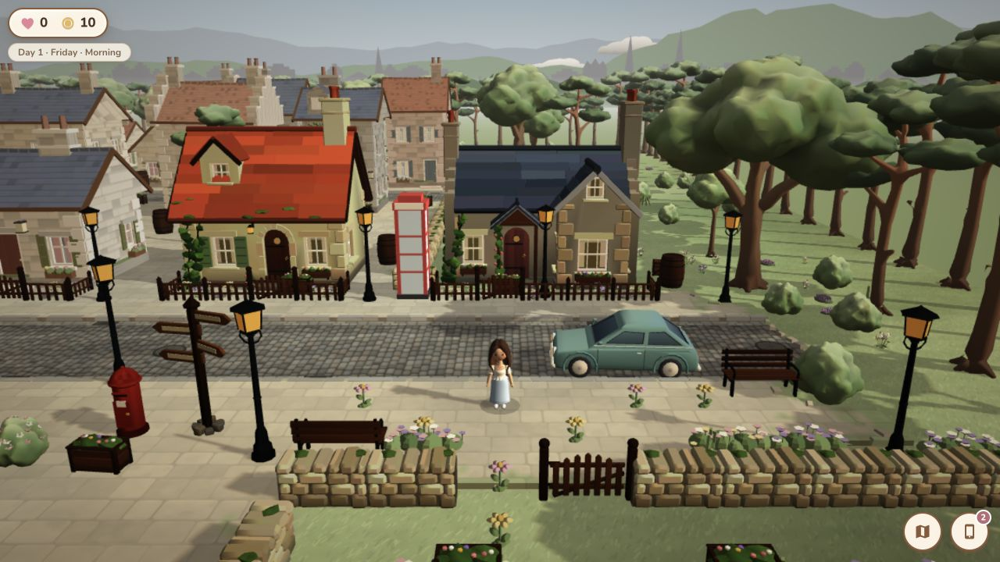
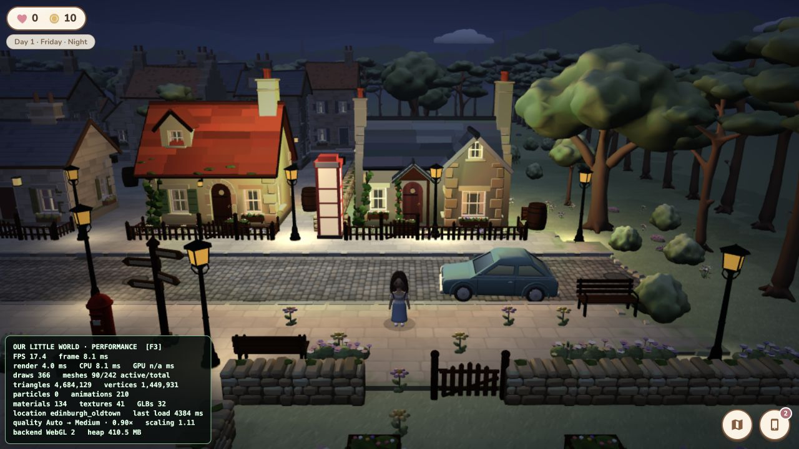
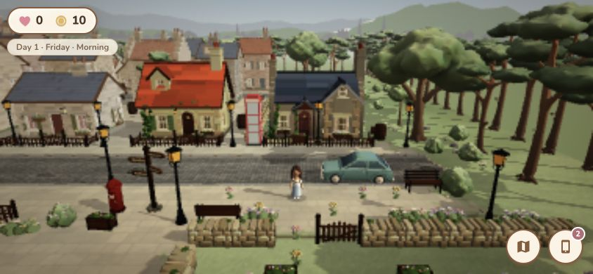
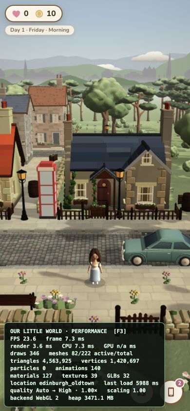

# Babylon 3D performance pass results

The pass preserves the current 3D art direction and gameplay while reducing redundant render work, making scaling explicit, and making district transitions resource-stable.

## Measured result

Same fixed Edinburgh Old Town states and viewport as the baseline:

| State | Draw calls before → after | Change | Triangles before → after | Change | Active / total meshes after |
| --- | ---: | ---: | ---: | ---: | ---: |
| Morning | 382 → 365 | -17 (-4.5%) | 4,761,957 → 4,683,109 | -1.7% | 89 / 224 |
| Evening | 384 → 366 | -18 (-4.7%) | 4,764,685 → 4,684,129 | -1.7% | 90 / 224 |
| Night | 391 → 366 | -25 (-6.4%) | 4,769,067 → 4,684,129 | -1.8% | 90 / 242 |

Visual resource counts remain intentionally similar because no world density, building, character, or authored-scene content was removed. The deterministic improvement comes primarily from shadow-caster eligibility and lower night-light/shadow work under Auto/Medium.

Observed optimized render samples were 3.6 ms morning, 6.2 ms evening, and 4.0 ms night in the automated browser. The baseline samples were 5.9/5.9/5.3 ms, but these timings are too noisy to present as a device speedup. GPU timer queries remained unavailable.

Local-development location loads after the cache was warm were 4.4–5.9 seconds. One cold/instrumented run was 30.4 seconds. A matching cold-load number was not captured before the pass, so no unsupported before/after load claim is made.

## Implemented changes

- Added an F3 profiler with FPS, frame/render/CPU/GPU timing (GPU when supported), draw calls, active/total meshes, particles, triangles, vertices, animations, materials, textures, loaded GLBs, location load time, quality, resolution scale, backend, and optional JS heap.
- Kept profiler code in an async chunk and excluded its instrumentation chunks from normal PWA precaching. Development can load it with F3; production must explicitly use `?perf=1`. When hidden it has no polling timer.
- Added persistent Auto/High/Medium/Low graphics presets and 60/30/uncapped frame preferences under the title screen's collapsed Graphics settings control.
- Auto quality uses capabilities, pointer type, viewport pixel load, and device pixel ratio rather than user-agent sniffing.
- Added conservative dynamic resolution: one sample per second, six seconds below target before reducing scale, 18 seconds above target before increasing it, and bounded profile-specific floors/ceilings to avoid oscillation.
- Paused rendering in hidden tabs, reset delta time on resume, and retained a 50 ms gameplay-delta clamp.
- Reduced shadow load for small props whose shadows did not justify the cost; retained prominent architecture, trees, characters, cars, posts, and walls.
- Scaled shadow-map size, filtering, frustum, and warm point-light pool by quality. Night still retains visible lamp pools and the authored atmosphere.
- Preserved thin instancing/static matrix freezing and stopped hidden GLB prototypes from entering the shadow render list.
- Added distance tiers for NPCs: full near updates, 5 Hz mid-distance updates, and disabled meshes/paused animation groups beyond 26 world units.
- Replaced the interaction system's full scan with four-unit spatial buckets and squared-distance checks.
- Throttled nearby interaction and world-edge checks to 10 Hz, removed per-frame player input objects, and removed occlusion slab-test arrays.
- Removed the HUD's one-second clock poll; supported time changes already emit events.
- Fixed district teardown ownership for instances, hierarchies, shadow casters, and procedural gutter/grate/manhole textures.
- Added deterministic benchmark mode that suppresses save, quest, encounter, and time-progression side effects.

## Asset audit

Run `npm run audit:performance` for the repeatable table.

- 32 GLBs, 3.60 MiB total.
- 29 static/legacy hero GLBs use `KHR_mesh_quantization`.
- The three skinned character GLBs retain their animation-compatible layout.
- Three embedded textures total; each is a 256 × 256 PNG face texture.
- Zero textures over 2,048 px (indeed, none over 256 px).
- Zero unreachable scene nodes.
- Static environment assets are merged to one mesh with material primitives, centrally cached, and reused by thin instances where repeated.
- No image-quality reduction or geometry removal was needed. Additional lossy texture compression would have negligible value for three tiny character textures.

## Lifecycle and memory regression

Run:

```text
/?perf=1&memoryTest=1&benchmark=1&benchmarkTime=morning
```

This performs Edinburgh Old Town → Dean Village → University ten times (30 full loads), waits two rendered frames after every load, and writes the samples to the page. The captured data is in [`performance-memory-test.json`](performance-memory-test.json).

The first cycle warms asynchronous prototypes. From cycle two through cycle ten, every district returns to the same counts:

| District | Meshes | Materials | Textures | Animation groups | Animatables | Observers | Shadow casters |
| --- | ---: | ---: | ---: | ---: | ---: | ---: | ---: |
| Old Town | 226 | 134 | 40 | 10 | 138 | 35 | 62 |
| Dean Village | 192 | 131 | 37 | 10 | 138 | 35 | 51 |
| University | 174 | 130 | 35 | 5 | 69 | 35 | 35 |

The first run exposed a real leak of nine procedural textures per A→B→C cycle; ownership was fixed and the full test was rerun. Browser-reported JS heap showed a repeating sawtooth rather than monotonic growth, but the automation renderer was already near 4 GB and later crashed. Heap numbers from that host are therefore retained in the JSON but are not treated as trustworthy mobile memory measurements.

## Visual and responsive checks

- Desktop day and night were inspected after the pass.
- Phone landscape (844 × 390) and portrait (390 × 844) layouts were inspected for clipping/readability.
- The browser harness does not emulate a real coarse pointer, so it showed desktop controls in resized viewports. The existing joystick/pointer control path was code-audited but must still be exercised on physical touch hardware.










## Honest device conclusion

Deterministic renderer work and lifecycle stability improved without lowering scene quality. This environment cannot validate sustained 60 FPS on the user's exact desktop GPU or sustained 30 FPS on an iPhone 12/older phone, and it cannot provide reliable GPU timing or thermal behavior. Those targets remain physical-device acceptance checks; the new profiler, presets, benchmark state, and dynamic resolution make those checks reproducible and give older hardware a graceful fallback.

## Validation

- `npx tsc --noEmit` — passed.
- `npm run build` — passed; 1,293 modules transformed in 1m 24s on the final run.
- Final PWA precache — 284 entries / 6,388.30 KiB. The two diagnostic chunks (profiler 10.50 KiB raw and scene instrumentation 13.13 KiB raw) are emitted for explicit use but excluded from normal precache.
- Production preview guard — normal entry created no profiler; explicit `?perf=1` created it.
- `npm run audit:hd` — passed with no missing texture keys.
- `npm run audit:performance` — passed; 32 GLBs / 3.60 MiB / zero oversized textures / zero unreachable nodes.
- `git diff --check` — clean.
